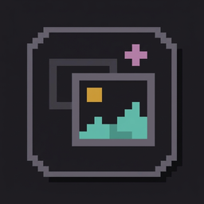

<p align="center">
  
</p>

<h1 align="center">Asset Prompter · website</h1>

<p align="center">
  The source of <a href="https://assetprompter.com">assetprompter.com</a>, the website of Asset Prompter.<br>
  Looking for the app itself? It lives in <a href="https://github.com/Djordje1998/asset-prompter">Djordje1998/asset-prompter</a>.
</p>

<p align="center">
  <a href="https://assetprompter.com">Website</a> ·
  <a href="https://assetprompter.com/sr/">Srpski</a> ·
  <a href="https://assetprompter.com/guides/">Guides</a> ·
  <a href="https://github.com/Djordje1998/asset-prompter">App repository</a> ·
  <a href="https://github.com/Djordje1998/asset-prompter/blob/master/AGENT-INSTALL.md">Install</a>
</p>

<p align="center">
  <a href="https://github.com/Djordje1998/asset-prompter-landing-page/actions/workflows/check.yml"></a>
  
  
  
</p>

<p align="center">
  
</p>

## What Asset Prompter is

A free local app for Windows and Linux. Your coding agent (Claude Code, Codex, Cursor and others) writes the prompt for an image or a video. You generate it by hand in the tool you already use (Midjourney, Google Flow, ChatGPT Images and others) and drop the result back. The agent sees every version. No account, no API key.

**To install it, read the [app's README](https://github.com/Djordje1998/asset-prompter#install), or paste this into your agent:**

```
Install Asset Prompter for me: follow https://github.com/Djordje1998/asset-prompter/blob/master/AGENT-INSTALL.md
```

## What is in this repository

Only the website: a static page in English and Serbian, a few guides, and the files search engines and link previews ask for. GitHub Pages serves the `main` branch as it is.

| | |
| --- | --- |
| `index.html`, `styles.css`, `main.js`, `assets/` | The page |
| `sr/` | The Serbian pages, made by `node tools/build-sr.mjs` |
| `guides/` | The guides |
| `tools/` | The build, the checks and small helpers |

To work on the site, read [MAINTAINING.md](MAINTAINING.md). It covers how the page is built, how languages and guides work, and the checks every pull request runs.

## Feedback

Questions and ideas about the app go to the [app's issues](https://github.com/Djordje1998/asset-prompter/issues). Problems with the website itself go to [this repository's issues](https://github.com/Djordje1998/asset-prompter-landing-page/issues).
